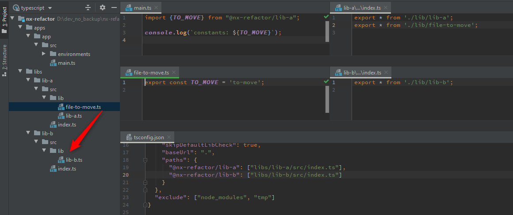
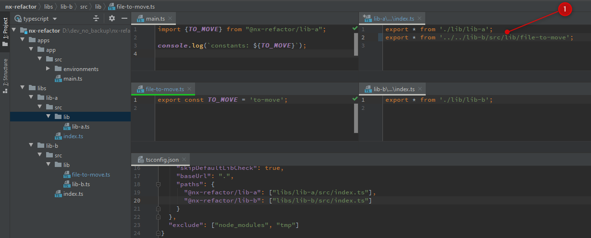
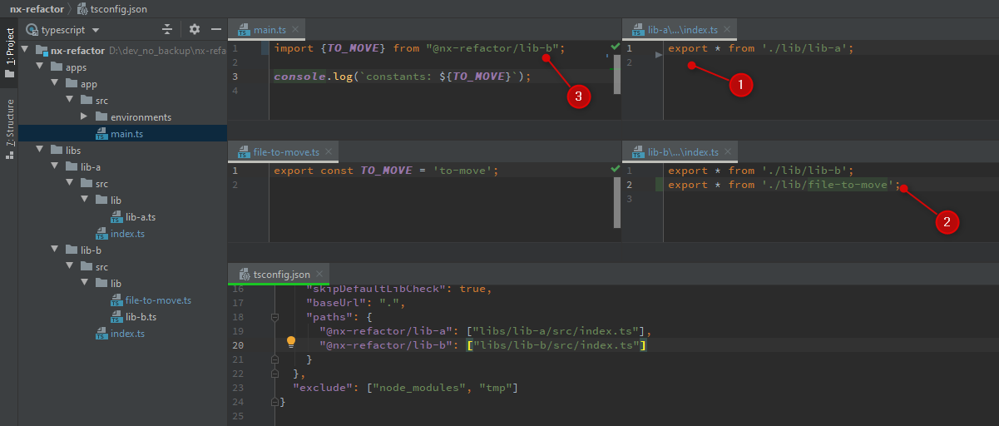

# NxRefactor

This is a simple default [Nx](https://nx.dev) to test refactoring.

Currently, refactoring is a pain, because the IDEs do not correctly
 update the import statements/index.ts files.

The screenshots below show what happens in IntelliJ IDEA 2020.1, 
but also VsCode is not able to handle this case.

**Before refactoring** we have this situation:

* a simple node-js app
* lib-a
* lib-b

The focus is on `file-to-move.ts` in `lib-a`:
* the file exports a constant `TO_MOVE`
* the barrel file `index.ts` in `lib-a` re-exports everything from `file-to-move.ts` so that 
the constant `TO_MOVE`
is also available outside of `lib-a`
* the `main.ts` file of the node-app imports the `TO_MOVE` constant using the path 
`@nx-refactor/lib-a` which is specified in `tsconfig.tx`     

Now we move `file-to-move.ts` from `lib-a` to `lib-b`.  
Here is the **actual refactoring** in IntelliJ IDEA 2020.1:

Notes:
* the barrel file `index.ts` in `lib-a` has been updated and now references `file-to-move.ts` 
via a relative deep import into `lib-b``. This import is forbidden by nx - libraries must not use
deep imports in to other libraries.

**Expected Refactoring**  
This is the expected refactoring tha should happen instead:

Notes:
1. the export of `file-to-move.ts` must be removed from barrel file `index.ts` in `lib-a`, since
`file-to-move.ts` is not part of the library anymore
2. a new export for `file-to-move.ts` must be added to the barrel file `index.ts` in `lib-b`
3. all import statements - in this case only in `main.tx` must be updated to the new path: `@nx-refactor/lib-b`

Additional info
* after cloning the project run `yarn install`
* to build the app run `nx build app`
* to serve the app run `nx serve app`

References:

* [SO: "IDE - auto-update imports when moving files between libs/barrels"](
https://stackoverflow.com/questions/61556751/ide-auto-update-imports-when-moving-files-between-libs-barrels)
